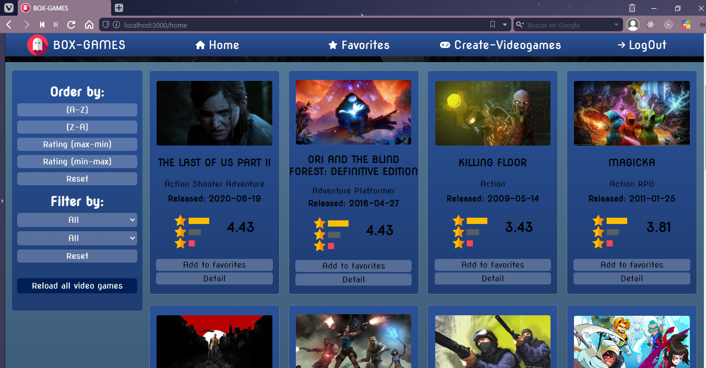

<h1 align="center">Hola 🙋‍♂️, soy Leandro!</h1>
<h2 align="center">Full stack developer ⚡ (Medellín-Colombia)🌎</h2>
 
 

<h3 align="left">💡 Habilidades:</h3>

<ul>
  <li>HTML</li>
  <li>CSS</li>
  <li>JavaScript</li>
  <li>Sass</li>
  <li>React</li>
  <li>Redux toolkit</li>
  <li>Node JS</li>
  <li>Express</li>
  <li>PostgreSQL</li>
  <li>Sequelize</li>
  <li>Git</li>
</ul>

---

<h2>📁 Mis proyectos</h2>
 

<h2>🎮 Box-Games:<h3>

Este proyecto es una single page application (SPA) con temática de videojuegos, donde los usuarios pueden ver información relacionada con cientos de videojuegos, algunas de las funcionalidades son: 

<ul>
  <li>Buscar videojuegos por nombre.</li>
  <li>Agregar/eliminar juegos a favoritos.</li>
  <li>Ver el detalle de cada videojuego. </li>
  <li>Ordenar videojuegos por nombre y rating. </li>
  <li>Filtrar videojuegos port tipo y género. </li>
  <li>Crear videojuegos</li>
</ul>
 

 

<h3>💻 Tecnologías usadas: </h3>
HTML-CSS-JavaScript-React-Redux toolkit-SASS-Node JS-Express-PostgreSQL-Sequelize

 

<h3>Repositorio:</h3>

---
 

<h2>📪 Contáctame:<h2/>
 
<ul>
  <li> <a href="https://github.com/LEOBC04">https://github.com/LEOBC04</a></li>
  <li> <a href="https://www.linkedin.com/in/leandrobc/">www.linkedin.com/in/leandrobc</a></li>
  <li> <a href="lbuitragoc04@gmail.com">lbuitragoc04@gmail.com</a></li>
</ul>

